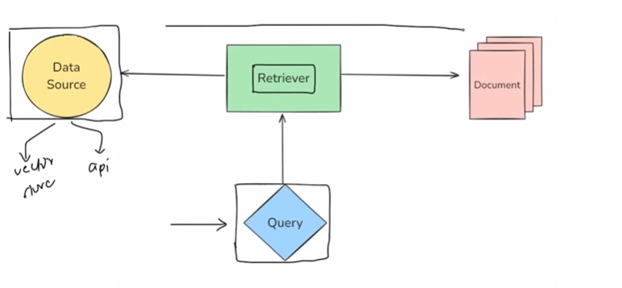
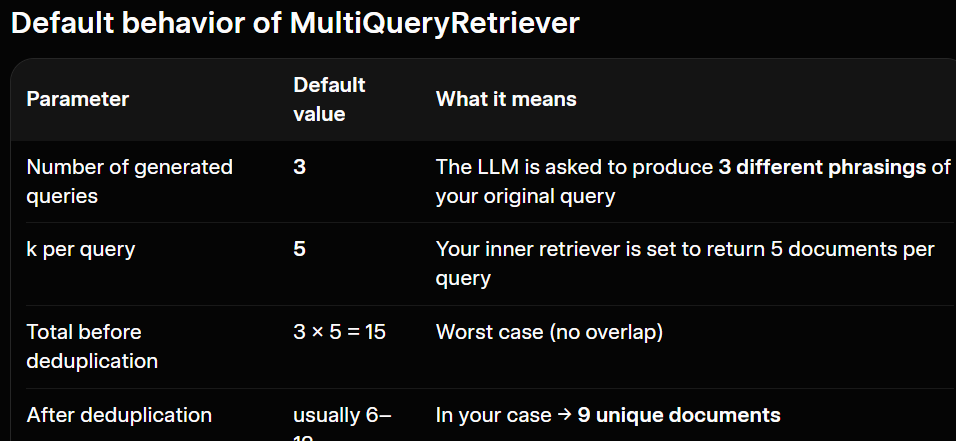

RETRIEVERS are mostly used for improving ur RAG projs 

A **retriever** is a component in LangChain that fetches relevant documents from a data source in response to a user's query.

There are multiple types of retrievers

All retrievers in LangChain are runnables




## Types of Retrievers

It is based on Datasource

- 1 Wikipedia Retriever, Vector Store ret.., Archive Ret...(research paper scan and get results),  etc

Base on Search strategy

- MMR(only unique docs), Multiquery retriever(for perfect ans for ambigous ques), contextual compression re t.., etc

### Wikipedia Retriever

A Wikipedia Retriever is a retriever that queries the Wikipedia API to fetch relevant content for
a given query.

**How It Works**

1. You give it a query (e.g., "Albert Einstein")
2. It sends the query to Wikipedia's API

3. It retrieves the most relevant articles

4. It returns them as LangChain Document objects

### MMR

Issue: 
eg. 1 artic glacier are melting due to climate chng.
2 climate chng is causing glaciers to melt
(Both are basically same res)

**"How can we pick results that are not only relevant to the query but also different from each other?"**


Maximal Marginal Relevance(MMR) is an information retrieval algorithm designed to reduce redundancy in the retrieved
results while maintaining high relevance to the query.

Why MMR Retriever?
In regular similarity search, you may get documents that are:

. All very similar to each other

. Repeating the same info

. Lacking diverse perspectives

MMR Retriever avoids that by:

. Picking the most relevant document first

. Then picking the next most relevant and least similar to already selected docs

. And so on ...

This helps especially in RAG pipelines where:

. You want your context window to contain diverse but still relevant information

. Especially useful when documents are semantically overlapping


#### Extra:
Activating retrievers of diff types - 

```bash

# Default - Similarity search
retriever = vectorstore.as_retriever(search_type="similarity", search_kwargs={"k": 2})
# or 
retriever = vector_store.as_retriever(search_kwargs={"k": 2})


# Enable MMR in the retriever
retriever = vectorstore.as_retriever(
    search_type="mmr",                   # <-- This enables MMR
    search_kwargs={"k": 3, "lambda_mult": 0.5}  # lambda_mult = relevance-diversity balance, if 1 acts like default similarity search
)
```

### MultiQuery Retriever
The MQR func is like a chain of tasks - 
1. Query is obtained
2. 3 more similar query is generated via *LLM*
3. via *embed model* retrieve answer to the queries 
4. AND the no. of docs each query returns depend on *k*

- Proof of 3rd, i.e this is same as for calling Similarity search
```bash 
vectorstore.as_retriever(search_kwargs={"k": 5})
```

```bash
from langchain_classic.retrievers import MultiQueryRetriever
```

Sometimes a single query might not capture all the ways information is phrased in your documents.

For example:

Query

"How can I stay healthy?"

Could mean:

. What should I eat?

. How often should I exercise?

. How can I manage stress?

*A simple similarity search might miss documents that talk about those things but don't use the word "healthy."*


1. Takes your original query

2. Uses an LLM (e.g., GPT-3.5) to generate multiple semantically different versions of that query

3. Performs retrieval for each sub-query

4. Combines and deduplicates the results


**EXAMPLE: for below query -**

*"How can I stay healthy?"*
```bash
multiquery_retriever = MultiQueryRetriever.from_llm(
    retriever=vectorstore.as_retriever(search_kwargs={"k": 5}),
    llm=model
)
```
- These queries are generated
1. "What are the best foods to maintain good health?"

2. "How often should I exercise to stay fit?"

3. "What lifestyle habits improve mental and physical wellness?'

4. "How can I boost my immune system naturally?"

5. "What daily routines support long-term health?"

- BUT even though we specified k=5,\
k=5 only controls how many documents each individual query retrieves — not the total number after multi-query expansion




### Contextual Compression Retriever

#### THis is like an chain too
*text splliter can result into this situation*

**SOMETIMES a document's content may not be perfect, eg below. So we compress content of doc further**

The Contextual Compression Retriever in LangChain is an advanced retriever that improves rêtrieval quality by compressing documents after retrieval - keeping only the relevant  content based on the user's query.

? Query:

"What is photosynthesis?"

Retrieved Document (by a traditional retriever):

"The Grand Canyon is a famous natural site.
Photosynthesis is how plants convert light into energy.
Many tourists visit every year."


X Problem:

· The retriever returns the entire paragraph

. Only one sentence is actually relevant to the query

. The rest is irrelevant noise that wastes context window and may confuse the LLM

What Contextual Compression Retriever does:

Returns only the relevant part, e.g.
"Photosynthesis is how plants convert light into energy."

```bash
# Set up the compressor using an LLM
compressor = LLMChainExtractor.from_llm(model)

# Create the contextual compression retriever
compression_retriever = ContextualCompressionRetriever(
    base_retriever=base_retriever,
    base_compressor=compressor
)
```

### MORE retrievers

https://docs.langchain.com/oss/python/integrations/retrievers

