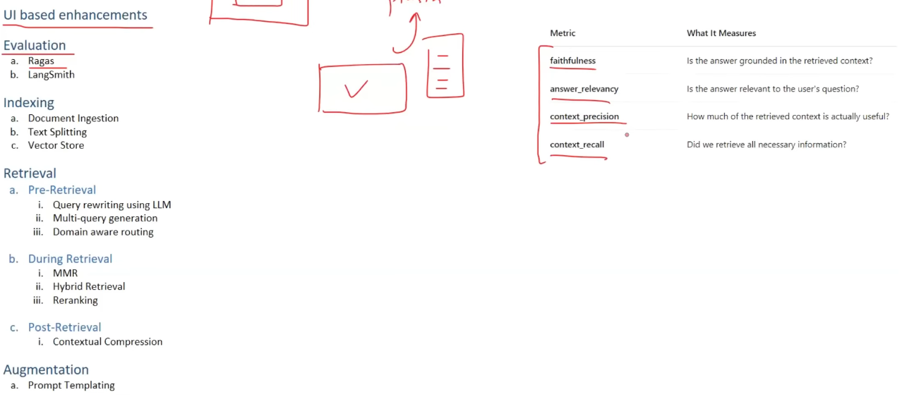
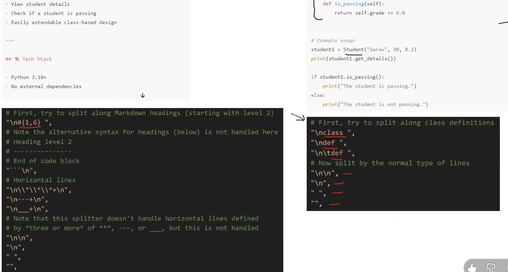
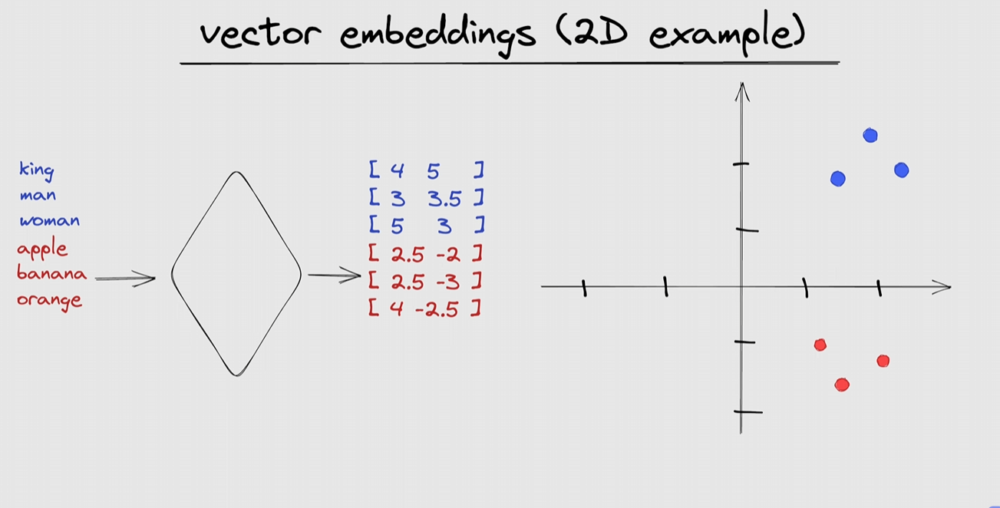
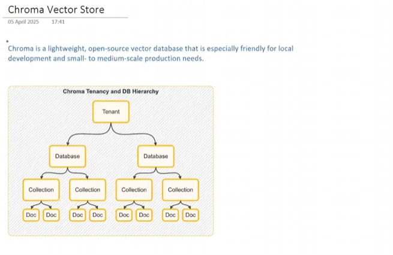

# Youtube 

For this project, the transcript can be loaded using 
1) YTLoader (its little buggy)
2) Youtube API
We'll choose 2nd

**RecursiveCharacterTextSplitter(chunk_size=1000, chunk_overlap=200)** /

Chunk Size refers to the maximum number of characters allowed in each text chunk. In this case, chunk_size=1000 means each chunk will contain up to 1,000 characters./
Chunk Overlap refers to the number of characters shared between consecutive chunks.  With chunk_overlap=200, the last 200 characters of one chunk are repeated at the beginning of the next chunk.**Also chunk_overlap should be 20% of chunk_size**. Chunk Overlap refers to the number of characters shared between consecutive chunks.  With chunk_overlap=200, the last 200 characters of one chunk are repeated at the beginning of the next chunk

- After len(chunks) u find 168 here, consider that as 168 doc, each receiving special id,etc


### Retriever
- it acts as Runnable

from langchain_community.vectorstores import FAISS\
vector_store = FAISS.from_documents(chunks, embeddings)\
retriever = vector_store.as_retriever(search_type="similarity", search_kwargs={"k": 4}) (k=4 means no. of docs)\
retriever.invoke('What is deepmind')


### Improvement methods

1) create website which takes utube url, and we chat or chrome plugin



2) Evaluation 
a) Ragas - the meetrics it uses is shown in the right
...
..

5.b answer grounding means to make sure llm answer based on context, no hallucinating

7.a Multimoadal - along with answering to text, could ingrain cababilities like responding to images, video, - create video, etc

7.b agentic - can go in internet and browse, maybe fill forms


# TextSplitter

**CharacterTextSplitter** - useless

**RecursiveCharacterTextSplitter** tries to split based on parargraph(\n\n) -> sentences(\n) -> words(' ') -> character('')

- it'll actively try to avoid chunking based on character, improving chunk meaning
```bash
from langchain_text_splitters import RecursiveCharacterTextSplitter, Language

splitter = RecursiveCharacterTextSplitter(chunk_size=1000, chunk_overlap=200)
chunks = splitter.split_text(text)
```

## **Document Structured/ RecChar Text splitter - Markdown/Python/Javascript/..** 
can split accurately even when code is written, like based on class -> def ... -> paragraph(\n\n)...



```bash
from langchain_text_splitters import RecursiveCharacterTextSplitter, Language

splitter = RecursiveCharacterTextSplitter.from_language(language= Language.PYTHON, chunk_size= 1000, chunk_overlap=200)

chunks = splitter.create_documents([transcript])

```

### EXTRA
Use split_text when you're working with raw text and need to chunk it.  Use create_documents when you want to convert those chunks into structured Document objects for use in LangChain pipelines, especially when integrating with vector databases


## Semantic Meaning Based

"""
Farmers were working hard in the fields, preparing the soil and planting seeds for
the next season. The sun was bright, and the air smelled of earth and fresh grass.
.The Indian Premier League (IPL) is the biggest cricket league in the world. People
all over the world watch the matches and cheer for their favourite teams.

Terrorism is a big danger to peace and safety. It causes harm to people and creates
fear in cities and villages. When such attacks happen, they leave behind pain and
sadness. To fight terrorism, we need strong laws, alert security forces, and support from people who care about peace and safety.
"""

**USE :**
*NOW* in this statement there are 3 seperate paragh, but if used previous Text splitters - 'it'll be divivded based on paragh, no. of char, etc'.
**BUT** in order to split based on meaning we use **Semantic Meaning Based** approach

**Procedure :**
Divide the *entire* into sentences, then ->
Find vector between sentences using NLP. ->
then find 'any kind of **distance**' between them(eg. std) ->
if *dist* more separate doc.

```bash
text_splitter = SemanticChunker(
OpenAIEmbeddings(), breakpoint_threshold_type="standard_deviation,
breakpoint_threshold_amount=1
)

docs = splitter.create_documents([transcript])
print(len(docs))
print(docs)
```

**EXTRA :** ITS still not considered best.


# Vectore Stores

After finding Vectors plot- 


*What is vector stores*

A vector store is a system designed to store and retrieve data represented as numerical
vectors.

Key Features

1. Storage - Ensures that **vectors and their associated metadata are retained**, whether *in-memory* for quick lookups or *on-disk* for durability and large-scale use.

(in-memory - RAM, on-disk - Hardrive)\

2. Similarity Search - Helps retrieve the vectors most similar to a 'query vector'*(i.e vector of quest and others).*

3. Indexing - Provide a data structure or method that enables fast similarity searches on
high-dimensional vectors (e.g., approximate nearest neighbor lookups- >*(research topic u can skip)*).

Suppose data dimension is 10lakh ->
then using any clustering algo created 10 clusters -> 
Each cluster has 1lakh data, find each clusters avg/centroid.

THEN we find similarity *betwn query and 10 centroid vectors* ->
Suppose C3 is the closest cluster, then find similariy *betwn query and 1lakh C3 vectors*


4. CRUD Operations - Manage the lifecycle of data-adding new vectors, reading them,
updating existing entries, removing outdated vectors.

Use-cases

1. Semantic Search
2. RAG
3. Recommender Systems
4. Image/Multimedia search


### Vector Store vs Vectore Database

 Vectore store - A system where we can store and retrieve based.

 Vectore Db - If further added features like -\
 Distributed Architecture(i.e where all processing doesnt occurs on a single server)\
 & Backup and restore & Acid transaction & authentication

*In short A vector database is effectively a vector store with extra database features (e.g.
clustering, scaling, security, metadata filtering, and durability)*

### Vectore store in Langchain
. Supported Stores: LangChain integrates with multiple *vector stores (FAISS, Pinecone, Chroma, Qdrant, Weaviate, etc.)*, giving you flexibility in scale, features, and deployment.

. Common Interface: A uniform Vector Store API lets you swap out one backend (e.g., FAISS) for
another (e.g., Pinecone) with minimal code changes.

. Metadata Handling: Most vector stores in LangChain allow you to attach metadata (e.g.,
timestamps, authors) to each document, enabling filter-based retrieval.


**Common functions for differenct Vector Store**\
from_documents( ... ) or from_texts( ... )

add_documents( ... ) or add_texts( ... )

similarity_search(query, k =... )

Metadata-Based Filtering


### Chroma Vector Store

It has few extra features making it closer to vector DB too.



Tenant = Users, Collection = Table ;\

users create database -> then create collection -> then store docs(which has embed.. & metadata)

```bash
pip install langchain chromadb openai tiktoken pypdf langchain_openai langchain-community

vector_store = Chroma(
    embedding_function=OpenAIEmbeddings(),
    persist_directory='my_chroma_db',
    collection_name='sample'
)
```
- btw, running this creates a new db folder with extra sql file  

Full code - https://colab.research.google.com/drive/1VwOywJ9LPSIpKWKj9vueVoexSCzGHXNC?usp=sharing

```bash
vector_store.get(include=['embeddings','documents', 'metadatas'])

{'ids': ['09a39dc6-3ba6-4ea7-927e-fdda591da5e4',
  '8b561bf2-72ce-4295-8097-27e6f3bcd582',
  'aa800a1a-4b4f-4e58-8fce-ae2279eb385b',
  'eb519603-4222-46d5-a596-11797a4d39b6',
  '1182b187-1e5b-4e2d-a076-0119742940cc'],
 'embeddings': array([[-0.00544442, -0.01907989,  0.00706373, ..., -0.01627786,
         -0.00032134,  0.00724619],
        [-0.00268021, -0.00010323,  0.02815653, ..., -0.01501936,
          0.00590092, -0.01164922],
        [ 0.00092799, -0.00476   ,  0.0124662 , ..., -0.01731381,
          0.00075886,  0.00296567],
        [-0.02714536,  0.00885395,  0.02699314, ..., -0.02592762,
          0.00900617, -0.01999116],
        [-0.01810451,  0.01281202,  0.0347942 , ..., -0.03034012,
         -0.00595078,  0.00521716]]),
 'documents': ["er."],
 'metadatas': [{'team': 'Royal Challengers Bangalore'},
  {'team': 'Mumbai Indians'},
  {'team': 'Chennai Super Kings'},
  {'team': 'Mumbai Indians'},
  {'team': 'Chennai Super Kings'}]}
```
- this shows that o/p displays ID first 

We can also update & delete document
```bash
# update documents
updated_doc1 = Document(
    page_content="Virat Kohli, the former captain of Royal Challengers Bangalore (RCB), is renowned for his aggressive leadership and consistent batting performances. He holds the record for the most runs in IPL history, including multiple centuries in a single season. Despite RCB not winning an IPL title under his captaincy, Kohli's passion and fitness set a benchmark for the league. His ability to chase targets and anchor innings has made him one of the most dependable players in T20 cricket.",
    metadata={"team": "Royal Challengers Bangalore"}
)

vector_store.update_document(document_id='09a39dc6-3ba6-4ea7-927e-fdda591da5e4', document=updated_doc1)

# view documents
vector_store.get(include=['embeddings','documents', 'metadatas'])

# delete document
vector_store.delete(ids=['09a39dc6-3ba6-4ea7-927e-fdda591da5e4'])

# filter method for
# meta-data filtering
vector_store.similarity_search_with_score(
    query="",
    filter={"team": "Chennai Super Kings"}
)

O/P:
[(Document(metadata={'team': 'Chennai Super Kings'}, page_content='MS Dhoni, famously known as Captain Cool, has led Chennai Super Kings to multiple IPL titles. His finishing skills, wicketkeeping, and leadership are legendary.'),
  0.6488258242607117),
 (Document(metadata={'team': 'Chennai Super Kings'}, page_content='Ravindra Jadeja is a dynamic all-r..'),
  0.4085893929004669)]


``` 