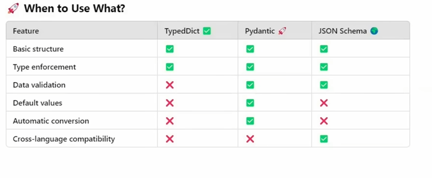

Ways to get structered output
1. typeddict 2. pydantic 3.json 

# typed dict
- it requires class
class Review(TypedDict):
    sentiment: str
    prodcut_id: int

BUT This is NOT object instantiation like:

obj = MyClass()

Instead, this is:

✅ “Type-annotated dictionary assignment”
new_review: Review = {..}

- main info
**from typing import TypedDict, Annotation, Optional, Literal**

**other than typedDict all 3 are used to support less fined tuned model to generate structed op**

**"optional_means : incase the info is not skip"**

- issues
No Validation (if inputed str instead of int, no error will  be thrown)

# pydantic
'Pydantic is a data validation and data parsing library for Python. It ensures that the data you work with is correct, structured, and type-safe.'
. need to install pydantic

- uses class stud(BaseModel)
- can store default values using "=" and "Field" 
- Optional can be set
- Type Coerce/Casting i.e if typed '32', o/p = 32
- *Builtin validation eg. EmailStr*
- *User Defined validation + more - using "Field Function" : default values, constraints, description, regex expressions*
eg. constraint parameter like gt, lt

- Returns pydantic object -> convert to json/dict
(can check type through type(new_student))
pydantic object calls data like class obj, 
eg ✅ print(res.name)   X print(res[name])

# Json schema

"When nultiple language eg. for backend javascript and front python"

- instead of Literal , 'enum' as key is used 

